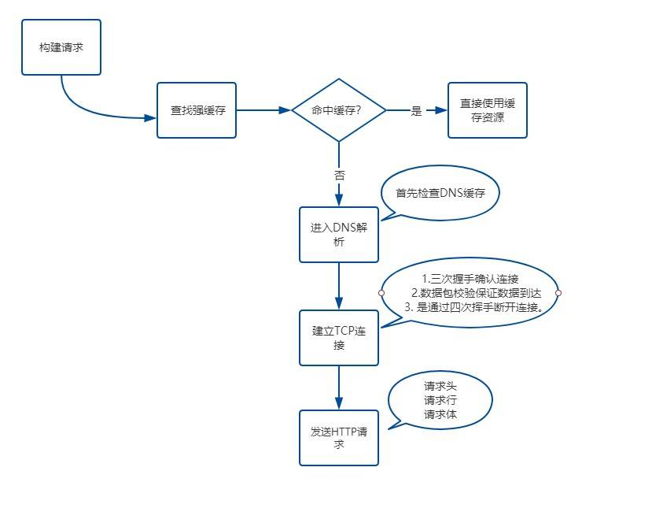
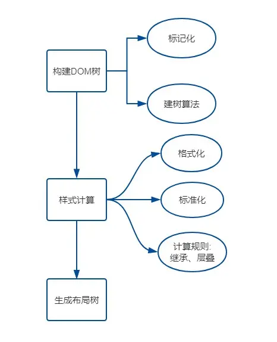

#### HTTP 状态码

- 1xx: 接受，继续处理
- 200: 成功，并返回数据
- 201: 已创建
- 202: 已接受
- 203: 成为，但未授权
- 204: 成功，无内容
- 205: 成功，重置内容
- 206: 成功，部分内容
- 301: 永久移动，重定向
- 302: 临时移动，可使用原有 URI
- 304: 资源未修改，可使用缓存
- 305: 需代理访问
- 400: 请求语法错误
- 401: 要求身份认证
- 403: 拒绝请求
- 404: 资源不存在
- 500: 服务器错误

#### CDN

#### GET / POST

- GET 请求参数放在 URL 上，POST 请求参数放在请求体里
- GET 请求参数长度有限制，POST 请求参数长度可以非常大
- POST 请求相较于 GET 请求安全一点点，因为 GET 请求的参数在 URL 上，且有历史记录
- GET 请求能缓存，POST 不能

#### 跨域 CORS / JSONP

> #### 浏览器内核

- IE：Trident
- Chrome：统称为 Chromium 内核，以前是 Webkit，现在是 Blink
- Firefox：Gecko
- Safari：Webkit
- Opera：最初是自己的 Presto 内核，后来是 Webkit，现在是 Blink 内核
- 360/猎豹：IE+Chrome 双内核

> #### 从 url 输入到页面展示

- DNS 解析
- TCP 三次握手
- 发送请求，分析 url，设置请求报文(头，主体)
- 服务器返回请求的文件 (html)
- 浏览器渲染

  - HTML parser --> DOM Tree
    - 标记化算法，进行元素状态的标记
    - dom 树构建
  - CSS parser --> Style Tree
    - 解析 css 代码，生成样式树
  - attachment --> Render Tree
    - 结合 dom 树 与 style 树，生成渲染树
  - layout: 布局
  - GPU painting: 像素绘制页面

  
  
  

> #### HTTP/1.0 和 HTTP/1.1 有什么区别

- `长连接`： HTTP/1.1 支持长连接和请求的流水线，在一个 TCP 连接上可以传送多个 HTTP 请求，避免了因为多次建立 TCP 连接的时间消耗和延时
- `缓存处理`： HTTP/1.1 引入 Entity tag，If-Unmodified-Since, If-Match, If-None-Match 等新的请求头来控制缓存
- `带宽优化及网络连接的使用`： HTTP1.1 则在请求头引入了 range 头域，支持断点续传功能
- `Host 头处理`： 在 HTTP/1.0 中认为每台服务器都有唯一的 IP 地址，但随着虚拟主机技术的发展，多个主机共享一个 IP 地址愈发普遍，HTTP1.1 的请求消息和响应消息都应支持 Host 头域，且请求消息中如果没有 Host 头域会 400 错误

> #### 介绍一下 HTTP/2.0 新特性

- `多路复用`： 即多个请求都通过一个 TCP 连接并发地完成
- `服务端推送`： 服务端能够主动把资源推送给客户端
- `新的二进制格式`： HTTP/2 采用二进制格式传输数据，相比于 HTTP/1.1 的文本格式，二进制格式具有更好的解析性和拓展性
- `header 压缩`： HTTP/2 压缩消息头，减少了传输数据的大小

> #### HTTP 和 HTTPS 有何区别

- HTTPS 使用 443 端口，而 HTTP 使用 80
- HTTPS 需要申请证书
- HTTP 是超文本传输协议，是明文传输；HTTPS 是经过 SSL 加密的协议，传输更安全
- HTTPS 比 HTTP 慢，因为 HTTPS 除了 TCP 握手的三个包，还要加上 SSL 握手的九个包

> #### XSS / CSRF

- XSS 攻击是指浏览器中执行恶意脚本, 然后拿到用户的信息进行操作。主要分为存储型、反射型和文档型。防范的措施包：

  - 不要相信用户的输入，对输入内容如\<script\>\<iframe\>等标签进行转义或者过滤转码或者过滤，让其不可执行。
  - 输入检查：对输入内容中的
  - 设置 httpOnly：很多 XSS 攻击目标都是窃取用户 cookie 伪造身份认证，设置此属性可防止 JS 获取 cookie
  - 开启 CSP，即开启白名单，可阻止白名单以外的资源加载和运行

- CSRF(Cross-site request forgery), 即跨站请求伪造，指的是黑客诱导用户点击链接，打开黑客的网站，然后黑客利用用户目前的登录状态发起跨站请求。
  CSRF 攻击一般会有三种方式:

  - 自动 GET 请求
  - 自动 POST 请求
  - 诱导点击发送 GET 请求。

  - 防范措施:
    1. 验证 Token：浏览器请求服务器时，服务器返回一个 token，每个请求都需要同时带上 token 和 cookie 才会被认为是合法请求
    2. 验证 Referer：通过验证请求头的 Referer 来验证来源站点，但请求头很容易伪造
    3. 设置 SameSite：设置 cookie 的 SameSite，可以让 cookie 不随跨域请求发出，但浏览器兼容不一
