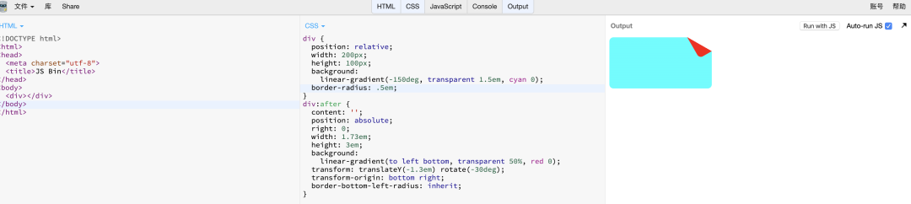

> #### 移动端 1px 解决方案

- 使用伪元素

  ```css
  .setBorder {
    position: relative;
    &:after {
      content: " ";
      position: absolute;
      top: 0;
      left: 0;
      width: 200%;
      height: 200%;
      transform: scale(0.5);
      transform-origin: left top;
      box-sizing: border-box;
      border: 1px solid #e5e5e5;
      border-radius: 4px;
    }
  }
  ```

  伪元素设置绝对定位，并且和父元素左上角对其。将伪元素的长和宽先放大 2 倍，然后再设置一个边框，以左上角为中心，缩放到原来的 0.5 倍

  - 优点：全机型兼容，实现了真正的 1px，而且可以圆角。

  - 缺点：暂用了 after 伪元素，可能影响清除浮动。

> #### 三角形

```css
// 通过设置border
.box {
  width: 0px;
  height: 0px;
  border-top: 50px solid rgba(0, 0, 0, 0);
  border-right: 50px solid rgba(0, 0, 0, 0);
  border-bottom: 50px solid green;
  border-left: 50px solid rgba(0, 0, 0, 0);
}
```

> #### js 实现 checkbox 全选以及反选

```html
<body>
  <button id="other">反选</button>
  <input type="checkbox" id="all" />全选
  <input type="checkbox" class="check" />1
  <input type="checkbox" class="check" />2
  <input type="checkbox" class="check" />3
  <script>
    var checkbox = document.getElementsByClassName("check");
    var checkAll = document.getElementById("all");
    var checkOther = document.getElementById("other");
    checkAll.onclick = function () {
      var flag = true;
      for (var i = 0; i < checkbox.length; i++) {
        if (!checkbox[i].checked) flag = false;
      }
      if (flag) {
        for (var i = 0; i < checkbox.length; i++) {
          checkbox[i].checked = false;
        }
      } else {
        for (var i = 0; i < checkbox.length; i++) {
          checkbox[i].checked = true;
        }
      }
    };
    checkOther.onclick = function () {
      for (var i = 0; i < checkbox.length; i++) {
        checkbox[i].checked = !checkbox[i].checked;
      }
    };
  </script>
</body>
```

> #### 扩大可点击区域

- 关键实现：`伪元素`

- 具体分析：利用伪元素和定位达到鼠标移到边缘时候出现手型且可点击

  ```css
  .expand-range {
    position: relative;
  }
  .expand-range:after {
    content: "";
    position: absolute;
    top: -10px;
    right: -10px;
    bottom: -10px;
    left: -10px;
  }
  ```

> #### 折角

- 关键实现：线性渐变

- 具体分析：150deg 是为了形成 30 度角，方便利用勾股定理测出各种长度


