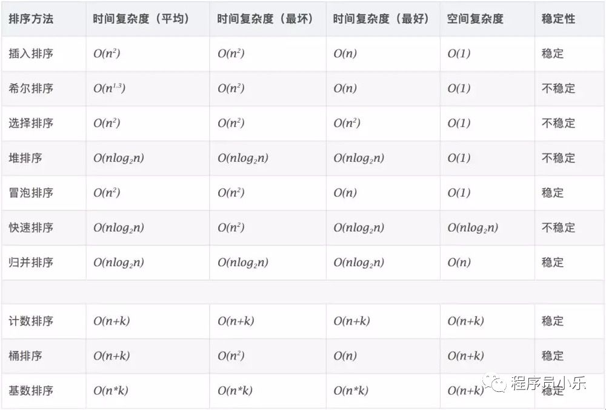

> #### 性能优化

优化策略：减少请求次数、减小资源大小、提高响应和加载速度、优化资源加载时机、优化加载方式

- 合并、压缩、混淆 html/css/js 文件（webpack 实现，减小资源大小，减少 HTTP 请求）
- Nginx 开启 Gzip，进一步压缩资源（减小资源大小）
- 图片资源使用 CDN 加速（提高加载速度）
- 符合条件的图标做 base64 处理（减小资源大小）
- 样式表放首部，JS 放尾部（JS 单线程，会阻塞页面；资源加载方式）
- 设置缓存（强缓存和协商缓存，提高加载速度）
- link 或者 src 添加 rel 属性，设置 prefetch 或 preload 可预加载资源。（加载时机）
- 如果使用了 UI 组件库，采用按需加载（减小资源大小）
- SPA 项目，通过 import 或者 require 做路由按需（减小资源大小）
- 服务端渲染 SSR，加快首屏渲染，利于 SEO
- 页面使用骨架屏，提高首页加载速度（提高加载速度）
- 使用 JPEG 2000, JPEG XR, and WebP 的图片格式来代替现有的 jpeg 和 png，当页面图片较多时，这点作用非常明显
- 使用图片懒加载-lazyload

> #### 首屏加载优化

- 降低请求量：合并资源，减少 HTTP 请求数，minify / gzip 压缩，webP，lazyload。
- 加快请求速度：预解析 DNS，减少域名数，并行加载，CDN 分发。
- 增加缓存：HTTP 协议缓存请求，离线缓存 manifest，离线数据缓存 localStorage、PWA。
- 渲染优化：首屏内容最小化，JS/CSS 优化，加载顺序，服务端渲染，pipeline。

> #### 骨架屏

> #### 排序算法

1. <font color="#f06">冒泡排序</font>：两两比较

  

- 普通版：

  ```js
  /*
  第1次循环确定最大的
  第n次循环确定第n大的
  */
  function BubbleSort(arr) {
    const length = arr.length;
    for (let i = 0; i < length; i++) {
      for (let j = 1; j < length - i; j++) {
        if (arr[j] < arr[j - 1]) {
          const temp = arr[j];
          arr[j] = arr[j - 1];
          arr[j - 1] = temp;
        }
      }
    }
    return arr;
  }
  ```

- 改进版：

  - 这个是优化过后的冒泡排序。用了一个 flag 来优化，它的意思是：如果某一次循环中没有交换过元素，那么意味着排序已经完成了。
  - 冒泡排序总会执行(N-1)+(N-2)+(N-3)+..+2+1 趟，但如果运行到当中某一趟时排序已经完成，或者输入的是一个有序数组，那么后边的比较就都是多余的，为了避免这种情况，我们增加一个 flag，判断排序是否在中途就已经完成（也就是判断有无发生元素交换）

    ```js
    function bubbleSort(arr) {
      for (let i = 0; i < arr.length; i++) {
        let flag = true;
        for (let j = 0; j < arr.length - i - 1; j++) {
          if (arr[j] > arr[j + 1]) {
            flag = false;
            let temp = arr[j];
            arr[j] = arr[j + 1];
            arr[j + 1] = temp;
          }
        }
        if (flag) break;
      }
      return arr;
    }
    ```

2. <font color="#f06">选择排序</font>：遍历自身以后的元素，最小的元素跟自己调换位置

  

    ```js
    function selectSort(arr) {
      var len = arr.length;
      for (let i = 0; i < len - 1; i++) {
        for (let j = i; j < len; j++) {
          if (arr[j] < arr[i]) {
            [arr[i], arr[j]] = [arr[j], arr[i]];
          }
        }
      }
      return arr;
    }
    ```

3. <font color="#f06">插入排序</font>: 即将元素插入到已排序好的数组中

  

    ```js
    function insertSort(arr) {
      for (let i = 1; i < arr.length; i++) {
        //外循环从1开始，默认arr[0]是有序段
        for (let j = i; j > 0; j--) {
          //j = i,将arr[j]依次插入有序段中
          if (arr[j] < arr[j - 1]) {
            [arr[j], arr[j - 1]] = [arr[j - 1], arr[j]];
          } else {
            break;
          }
        }
      }
      return arr;
    }
    ```

4. <font color="#f06">快速排序</font>

从数列中挑出一个元素，称为 “基准”（pivot）;

重新排序数列，所有元素比基准值小的摆放在基准前面，所有元素比基准值大的摆在基准的后面（相同的数可以到任一边）。在这个分区退出之后，该基准就处于数列的中间位置。这个称为分区（partition）操作；

递归地（recursive）把小于基准值元素的子数列和大于基准值元素的子数列排序；

递归的最底部情形，是数列的大小是零或一，也就是永远都已经被排序好了。虽然一直递归下去，但是这个算法总会退出，因为在每次的迭代（iteration）中，它至少会把一个元素摆到它最后的位置去。

  

- 口诀：插冒归基稳定，快选堆希不稳定
  

> #### XSS / CSRF

- <font color="#f06">XSS 攻击</font>是指浏览器中执行恶意脚本, 然后拿到用户的信息进行操作。主要分为存储型、反射型和文档型。防范的措施包括:

  - 一个信念: 不要相信用户的输入，对输入内容转码或者过滤，让其不可执行。
  - 两个利用: 利用 `CSP`，利用 `Cookie` 的 `HttpOnly` 属性。

- <font color="#f06">CSRF(Cross-site request forgery)</font>, 即跨站请求伪造，指的是黑客诱导用户点击链接，打开黑客的网站，然后黑客利用用户目前的登录状态发起跨站请求。
  CSRF 攻击一般会有三种方式:

  - 自动 GET 请求
  - 自动 POST 请求
  - 诱导点击发送 GET 请求。

  - 防范措施: 利用 `Cookie` 的 `SameSite` 属性、验证来源站点和 `CSRF Token`。

> #### 前后端路由差别

1. 后端每次路由请求都是重新访问服务器

2. 前端路由实际上只是 JS 根据 URL 来操作 DOM 元素，根据每个页面需要的去服务端请求数据，返回数据后和模板进行组合。

> #### TypeScript

> #### Webpack

> #### Echarts.js

> #### Flutter

> #### SSR
