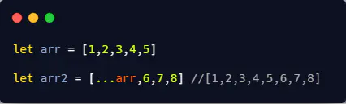
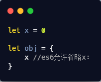
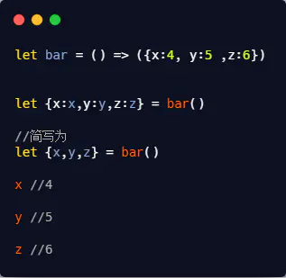
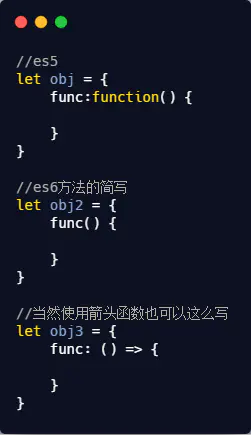

> #### let / var / const

- 块级作用域
- 暂时性死区
- const 声明变量不能改变，如果声明的是一个引用类型，则不能改变它的内存地址

> #### 常用 ES6

- Let 与 Const
- 类
- 模块化
- 箭头函数
- 函数参数默认值
- 模板字符串
- 解构赋值
- 延展操作符
- 对象属性简写
- Promise

> #### 箭头函数

1. 箭头函数没有 arguments（建议使用更好的语法，剩余运算符替代）

2) 箭头函数没有 prototype 属性，不能用作构造函数（不能用 new 关键字调用）

3. 箭头函数没有自己 this，它的 this 是词法的，引用的是上下文的 this，即在你写这行代码的时候就箭头函数的 this 就已经和外层执行上下文的 this 绑定了(这里个人认为并不代表完全是静态的,因为外层的上下文仍是动态的可以使用 call,apply,bind 修改,这里只是说明了箭头函数的 this 始终等于它上层上下文中的 this)

4. 箭头函数的 this 指向即使使用 call,apply,bind 也无法改变（这里也验证了为什么 ECMAScript 规定不能使用箭头函数作为构造函数，因为它的 this 已经确定好了无法改变）

> #### 扩展运算符`...`



> #### 对象属性/方法简写

es6 允许当对象的属性和值相同时，省略属性名



- 省略的是属性名而不是值
- 值必须是一个变量

对象属性简写经常与解构赋值一起使用



es6 允许当一个对象的属性的值是一个函数（即是一个方法），可以使用简写的形式



> #### 手写实现 4 种继承

```js
function Father () {}
function Child () {}
// 1\. 原型继承
Child.prototype = new Father()
// 2\. 构造继承
function Child (name) {
  Father.call(this, name)
}
// 3\. 组合继承
function Child (name) {
  Father.call(this, name)
}
Child.prototype = new Father()
// 4\. 寄生继承
function cloneObj (o) {
  var clone = object.create(o)
  clone.sayName = ...
  return clone
}
// 5\. 寄生组合继承
// 6\. ES6 class extend继承
```

> #### 手写 Promise

```js
var myPromise = new Promise((resolve, reject) => {
  // 需要执行的代码
  ...
  if (/* 异步执行成功 */) {
    resolve(value)
  } else if (/* 异步执行失败 */) {
    reject(error)
  }
})

myPromise.then((value) => {
  // 成功后调用, 使用value值
}, (error) => {
  // 失败后调用, 获取错误信息error
})
```

> #### Promise.all

> #### Promise.race

> #### async / await

> #### Proxy

> #### Object.definePropery
