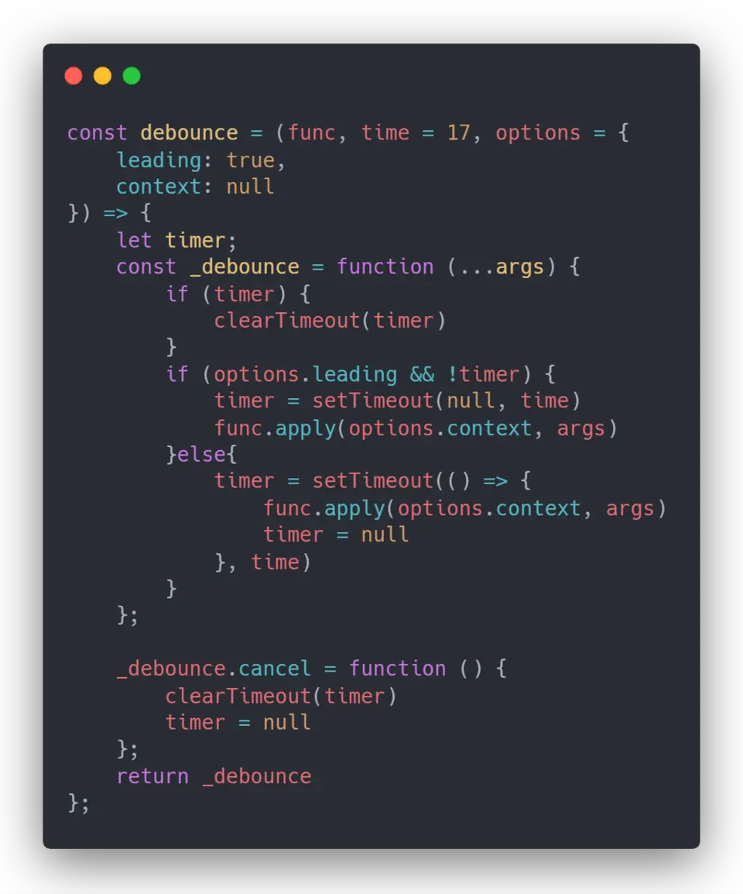
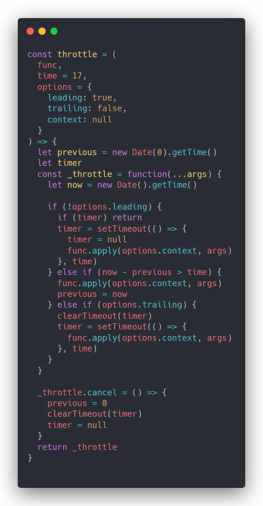

> #### JavaScript 数据类型

- 基本类型值指的是那些保存在栈内存中的简单数据段，即这种值是完全保存在内存中的一个位置。包含<font color="#f06">Number，String，Boolean，Null，Undefined，Symbol</font>

- 引用类型值指的是那些保存在堆内存中的对象，所以引用类型的值保存的是一个指针，这个指针指向存储在堆中的一个对象。除了上面的 6 种基本数据类型外，剩下的就是引用类型了，统称为 Object 类型。细分的话，有：Object 类型、Array 类型、Date 类型、RegExp 类型、Function 类型 等。

> #### 执行上下文

执行上下文是评估和执行 JavaScript 代码的环境的抽象概念。每当 Javascript 代码在运行的时候，它都是在执行上下文中运行。

- <font color="#69f">全局执行上下文</font> — 这是默认或者说基础的上下文，任何不在函数内部的代码都在全局上下文中。它会执行两件事：创建一个全局的 window 对象（浏览器的情况下），并且设置 `this` 的值等于这个全局对象。一个程序中只会有一个全局执行上下文。
- <font color="#69f">函数执行上下文</font> — 每当一个函数被调用时, 都会为该函数创建一个新的上下文。每个函数都有它自己的执行上下文，不过是在函数被调用时创建的。函数上下文可以有任意多个。每当一个新的执行上下文被创建，它会按定义的顺序（将在后文讨论）执行一系列步骤。
- <font color="#69f">Eval 函数执行上下文</font> — 执行在 `eval` 函数内部的代码也会有它属于自己的执行上下文，但由于 JavaScript 开发者并不经常使用 eval，所以在这里我不会讨论它。

> #### 原型与原型链

1. 所有的实例的 `__proto__` 都指向该构造函数的原型对象（`prototype`）。

2. 所有的函数（包括构造函数）是 `Function` 的实例，所以所有函数的 `__proto__` 的都指向 `Function` 的原型对象。

3. 所有的原型对象（包括 `Function` 的原型对象）都是 Object 的实例，所以 `__proto__` 都指向 `Object`（构造函数）的原型对象。而 Object 构造函数的 `__proto__` 指向 `null`。

4. `Function` 构造函数本身就是 `Function` 的实例，所以 `__proto__` 指向 `Function` 的原型对象。

> #### Javascript 如何实现继承？

> #### Javascript 创建对象的几种方式？

> #### new 运算符的执行过程

1. 新生成一个对象
2. 链接到原型: obj.**proto** = Con.prototype
3. 绑定 this: apply
4. 返回新对象(如果构造函数有自己 retrun 时，则返回该值)

> #### 作用域

> #### 闭包

- 概念: 内层函数能够访问外层函数作用域的变量
- 缺点: 引起内存泄漏（释放内存）
- 作用:
  - 使用闭包修正打印值
  - 实现柯里化
  - 实现 node commonJs 模块化, 实现私有变量
  - 保持变量与函数活性, 可延迟回收和执行

> #### 异步与单线程

> #### documen.write 和 innerHTML 的区别?

> #### 手写函数防抖和节流

防抖与节流函数是一种最常用的 高频触发优化方式，能对性能有较大的帮助。

- `防抖 (debounce)`: 将多次高频操作优化为只在最后一次执行，通常使用的场景是：用户输入，只需再输入完成后做一次输入校验即可。

  ```js
  function debounce(fn, wait, immediate) {
    let timer = null;

    return function () {
      let args = arguments;
      let context = this;

      if (immediate && !timer) {
        fn.apply(context, args);
      }

      if (timer) clearTimeout(timer);
      timer = setTimeout(() => {
        fn.apply(context, args);
      }, wait);
    };
  }
  ```

- 节流(throttle): 每隔一段时间后执行一次，也就是降低频率，将高频操作优化成低频操作，通常使用场景: 滚动条事件 或者 resize 事件，通常每隔 100~500 ms 执行一次即可。

  ```js
  function throttle(fn, wait, immediate) {
    let timer = null;
    let callNow = immediate;

    return function () {
      let context = this,
        args = arguments;

      if (callNow) {
        fn.apply(context, args);
        callNow = false;
      }

      if (!timer) {
        timer = setTimeout(() => {
          fn.apply(context, args);
          timer = null;
        }, wait);
      }
    };
  }
  ```

> #### 手写 Ajax

```js
var xhr = new XMLHttpRequest();
xhr.open("GET", url, false);
xhr.onreadtstatechange = function () {
  if (xhr.readystate == 4) {
    //响应内容解析完成，可以在客户端调用了
    if (xhr.status == 200) {
      //客户端的请求成功了
      alert(xhr.responseText);
    }
  }
};
xhr.send(null);
```

> #### this

> #### call / bind / apply

- 三者都是用来改变函数的 this 指向
- 三者的第一个参数都是 this 指向的对象
- bind 是返回一个绑定函数可稍后执行，call、apply 是立即调用
- 三者都可以给定参数传递
- call 给定参数需要将参数全部列出，apply 给定参数数组

> #### 浅拷贝/深拷贝

- 浅拷贝：浅拷贝的意思就是只复制引用，而未复制真正的值。

  1. <font color="#f06">Object.assign()</font>  
     Object.assign() 方法可以把任意多个的源对象自身的可枚举属性拷贝给目标对象，然后返回目标对象。但是 Object.assign() 进行的是浅拷贝，拷贝的是对象的属性的引用，而不是对象本身。

     ```js
     var obj = { a: { a: "kobe", b: 39 } };
     var initalObj = Object.assign({}, obj);
     initalObj.a.a = "wade";
     console.log(obj.a.a); // wade
     ```

     注意：当 object 只有一层的时候，是深拷贝

     ```js
     let obj = {
       username: "kobe",
     };
     let obj2 = Object.assign({}, obj);
     obj2.username = "wade";
     console.log(obj); //{username: "kobe"}
     ```

  2. <font color="#f06">Array.prototype.concat()`或`Array.prototype.slice()</font>  
     Array 的 slice 和 concat 方法不修改原数组，只会返回一个浅复制了原数组中的元素的一个新数组。

     ```js
     let arr = [
       1,
       3,
       {
         username: "kobe",
       },
     ];
     let arr2 = arr.concat();
     arr2[2].username = "wade";
     console.log(arr);
     ```

  3. <font color="#f06">= 赋值</font>

     ```js
     const originArray = [1, 2, 3, 4, 5];
     const originObj = { a: "a", b: "b", c: [1, 2, 3], d: { dd: "dd" } };

     const cloneArray = originArray;
     const cloneObj = originObj;

     console.log(cloneArray); // [1,2,3,4,5]
     console.log(originObj); // {a:'a',b:'b',c:Array[3],d:{dd:'dd'}}

     cloneArray.push(6);
     cloneObj.a = { aa: "aa" };

     console.log(cloneArray); // [1,2,3,4,5,6]
     console.log(originArray); // [1,2,3,4,5,6]

     console.log(cloneObj); // {a:{aa:'aa'},b:'b',c:Array[3],d:{dd:'dd'}}
     console.log(originArray); // {a:{aa:'aa'},b:'b',c:Array[3],d:{dd:'dd'}}
     ```

  上面的代码是最简单的利用 = 赋值操作符实现了一个浅拷贝，可以很清楚的看到，随着 cloneArray 和 cloneObj 改变，originArray 和 originObj 也随着发生了变化。

- 深拷贝：对目标的完全拷贝，不像浅拷贝那样只是复制了一层引用，就连值也都复制了。

  1. <font color="#f06">JSON.parse(JSON.stringify())</font>

     ```js
     const originArray = [1, 2, 3, 4, 5];
     const cloneArray = JSON.parse(JSON.stringify(originArray));
     console.log(cloneArray === originArray); // false

     const originObj = { a: "a", b: "b", c: [1, 2, 3], d: { dd: "dd" } };
     const cloneObj = JSON.parse(JSON.stringify(originObj));
     console.log(cloneObj === originObj); // false

     cloneObj.a = "aa";
     cloneObj.c = [1, 1, 1];
     cloneObj.d.dd = "doubled";

     console.log(cloneObj); // {a:'aa',b:'b',c:[1,1,1],d:{dd:'doubled'}};
     console.log(originObj); // {a:'a',b:'b',c:[1,2,3],d:{dd:'dd'}};
     ```

     - 只能适用于一些简单的情况，undefined、function、symbol 会在转换过程中被忽略，就不能用这个方法进行深拷贝。

  2. 利用<font color="#f06">递归</font>来实现每一层都重新创建对象并赋值

     ```js
     function deepClone(source) {
       const targetObj = source.constructor === Array ? [] : {}; // 判断复制的目标是数组还是对象
       for (let keys in source) {
         // 遍历目标
         if (source.hasOwnProperty(keys)) {
           if (source[keys] && typeof source[keys] === "object") {
             // 如果值是对象，就递归一下
             targetObj[keys] = source[keys].constructor === Array ? [] : {};
             targetObj[keys] = deepClone(source[keys]);
           } else {
             // 如果不是，就直接赋值
             targetObj[keys] = source[keys];
           }
         }
       }
       return targetObj;
     }
     ```

     ```js
     const originObj = { a: "a", b: "b", c: [1, 2, 3], d: { dd: "dd" } };
     const cloneObj = deepClone(originObj);
     console.log(cloneObj === originObj); // false

     cloneObj.a = "aa";
     cloneObj.c = [1, 1, 1];
     cloneObj.d.dd = "doubled";

     console.log(cloneObj); // {a:'aa',b:'b',c:[1,1,1],d:{dd:'doubled'}};
     console.log(originObj); // {a:'a',b:'b',c:[1,2,3],d:{dd:'dd'}};
     ```

     带有函数的：

     ```js
     const originObj = {
       name: "axuebin",
       sayHello: function () {
         console.log("Hello World");
       },
     };
     console.log(originObj); // {name: "axuebin", sayHello: ƒ}
     const cloneObj = deepClone(originObj);
     console.log(cloneObj); // {name: "axuebin", sayHello: ƒ}
     ```

总结：

- 赋值运算符 = 实现的是浅拷贝，只拷贝对象的引用值；
- JavaScript 中数组和对象自带的拷贝方法都是“首层深拷贝”；
- JSON.stringify 实现的是深拷贝，但是对目标对象有要求；
- 若想真正意义上的深拷贝，请递归。

> #### map / filter / reduce

- `map` 的作用是 map 中传入一个函数，该函数会遍历该数组，对每一个元素做变换之后返回新数组。

  - element : 对应数组的每个元素。
  - index: 数组元素的下标。
  - arr : 原数组。

  ```js
  let arr = [2, 3, 4];
  arr = arr.map(function (element, index, arr) {
    return arr[index] + 1;
  }); // [3,4,5]
  ```

- `filter` 的作用是也是生成一个数组，传入的函数返回值确实布尔类型，返回值为 true 的元素放入新数组，通常来筛选删除不需要的元素。

  - element : 对应数组的每个元素。
  - index : 数组元素的下标。
  - arr : 原数组。

  ```js
  let array = [1, 2, 4, 6];
  let arr = array.filter(function (element) {
    return element != 6;
  }); // [1,2,4]
  ```

- `reduce` 可以将数组中的元素通过回调函数最终转换为一个值。

  - acc：累计值(第一次的值代表初始化的值)。
  - element： 当前元素。
  - index： 当前索引。
  - arr： 原数组。

  ```js
  let arr = [1, 2, 3];
  let sum = arr.reduce(function (acc, element) {
    return acc + element;
  }, 0); // 6
  ```

> #### for in 和 for of 区别

- for in 遍历数组会遍历到数组原型上的属性和方法, 更适合遍历对象
- forEach 不支持 break, continue, return 等
- 使用 for of 可以成功遍历数组的值, 而不是索引, 不会遍历原型
- for in 可以遍历到 myObject 的原型方法 method,如果不想遍历原型方法和属性的话，可以在循环内部判断一 hasOwnPropery 方法可以判断某属性是否是该对象的实例属性

> #### JavaScript 数组去重

> #### 函数防抖



leading 为是否在进入时立即执行一次，原理是利用定时器，如果在规定时间内再次触发事件会将上次的定时器清除，即不会执行函数并重新设置一个新的定时器，直到超过规定时间自动触发定时器中的函数
同时通过闭包向外暴露了一个 cancel 函数，使得外部能直接清除内部的计数器

> #### 函数节流



和函数防抖类似，区别在于内部额外使用了时间戳作为判断，在一段时间内没有触发事件才允许下次事件触发，同时新增了 trailing 选项，表示是否在最后额外触发一次

> #### 正则
