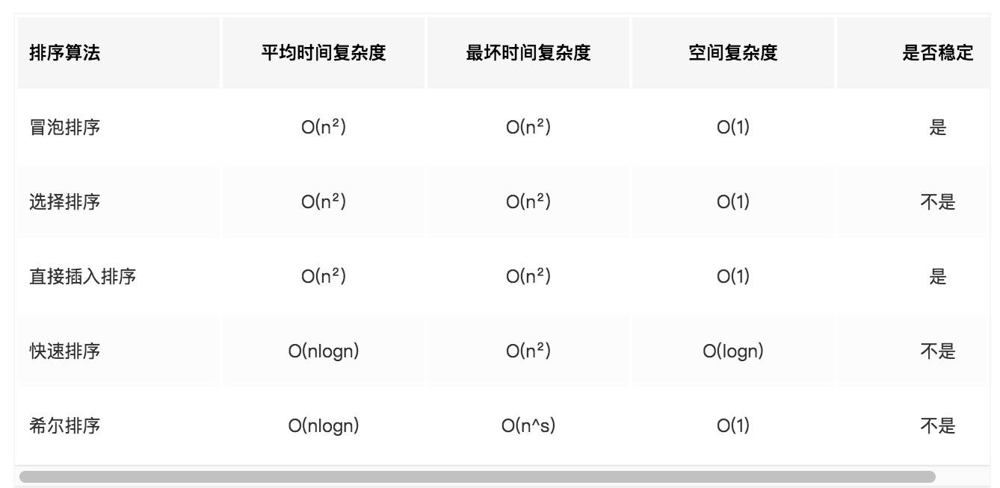

> #### 性能优化

> #### 首屏加载优化

- 降低请求量：合并资源，减少 HTTP 请求数，minify / gzip 压缩，webP，lazyload。
- 加快请求速度：预解析 DNS，减少域名数，并行加载，CDN 分发。
- 增加缓存：HTTP 协议缓存请求，离线缓存 manifest，离线数据缓存 localStorage、PWA。
- 渲染优化：首屏内容最小化，JS/CSS 优化，加载顺序，服务端渲染，pipeline。

> #### 骨架屏

> #### 排序算法

- 冒泡排序：两两比较

  ```js
  function bubleSort(arr) {
    var len = arr.length;
    for (let outer = len; outer >= 2; outer--) {
      for (let inner = 0; inner <= outer - 1; inner++) {
        if (arr[inner] > arr[inner + 1]) {
          [arr[inner], arr[inner + 1]] = [arr[inner + 1], arr[inner]];
        }
      }
    }
    return arr;
  }
  ```

- 选择排序：遍历自身以后的元素，最小的元素跟自己调换位置

  ```js
  function selectSort(arr) {
    var len = arr.length;
    for (let i = 0; i < len - 1; i++) {
      for (let j = i; j < len; j++) {
        if (arr[j] < arr[i]) {
          [arr[i], arr[j]] = [arr[j], arr[i]];
        }
      }
    }
    return arr;
  }
  ```

- 插入排序: 即将元素插入到已排序好的数组中

  ```js
  function insertSort(arr) {
    for (let i = 1; i < arr.length; i++) {
      //外循环从1开始，默认arr[0]是有序段
      for (let j = i; j > 0; j--) {
        //j = i,将arr[j]依次插入有序段中
        if (arr[j] < arr[j - 1]) {
          [arr[j], arr[j - 1]] = [arr[j - 1], arr[j]];
        } else {
          break;
        }
      }
    }
    return arr;
  }
  ```

- 口诀：插冒归基稳定，快选堆希不稳定
  

> #### XSS / CSRF

> #### TypeScript

> #### Webpack

> #### Echarts.js

> #### Flutter

> #### SSR
